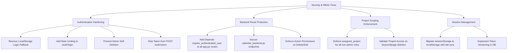

# Comprehensive RBAC, Authentication & Security Audit Report

**Document Version:** 1.0  
**Target Environment:** SEO-Backend (`FastAPI` + `PostgreSQL/Supabase` + `React/Vite`)  
**Audit Scope:** Role-Based Access Control (RBAC), Authentication Flow, Login Page, Session Tokens, User Management, API Authorization, and Manual Security Testing Findings.

---

## Executive Summary & Threat Matrix

| Issue ID | Category | Severity | Description | Status |
| :--- | :--- | :--- | :--- | :--- |
| **SEC-01** | **Authentication** | 🔴 **CRITICAL** | **Client-Side Offline Login Bypass in `LoginPage.jsx`**: Unauthenticated login allowed if backend throws network error. | Confirmed |
| **SEC-02** | **Authorization** | 🔴 **CRITICAL** | **Unprotected Sensitive Backend Endpoints**: Multiple destructive / operational API routes lack `Depends(require_authenticated_user)`. | Confirmed |
| **SEC-03** | **Authorization** | 🔴 **CRITICAL** | **Horizontal Privilege Escalation (IDOR/BOLA)**: `require_project_access` only checks vendors; non-vendor associates can access any project's data. | Confirmed |
| **SEC-04** | **Token Security** | 🟠 **HIGH** | **No Token Revocation / Blacklist on Logout**: JWT tokens remain valid for 24 hours even after logout. | Confirmed |
| **SEC-05** | **Token Security** | 🟠 **HIGH** | **Stale Token Claims**: JWT bakes in role & assigned project; changes made by admin do not invalidate or update the live token claims. | Confirmed |
| **SEC-06** | **Session / Storage** | 🟡 **MEDIUM** | **`sessionStorage` Multi-Tab Session Isolation**: Opening dashboard in a new tab causes immediate logout. | Confirmed |
| **SEC-07** | **Cryptography** | 🟠 **HIGH** | **Plaintext Password Fallback & Hardcoded JWT Secret**: Insecure fallback for plaintext password verification and default secret key. | Confirmed |
| **SEC-08** | **RBAC / API** | 🟠 **HIGH** | **Enforcement Gap Between UI and API for Action Permissions**: `View Only` permission is enforced only in frontend UI, not in backend endpoints. | Confirmed |
| **SEC-09** | **User Management** | 🟡 **MEDIUM** | **Admin Self-Deletion / Self-Disable Vulnerability**: Admin can delete or disable their own account, leading to system lockout. | Confirmed |
| **SEC-10** | **Information Disclosure** | 🟡 **MEDIUM** | **Admin User Creation Token Leak**: `POST /auth/users` returns an access token for the newly created user in admin's response. | Confirmed |

---

## 1. Deep-Dive Vulnerability & Defect Analysis

### 1.1 `SEC-01`: Client-Side Offline Login Bypass in `LoginPage.jsx`
- **Location:** [`frontend/seo-dashboard/src/components/pages/LoginPage.jsx:76-93`](file:///Users/anandkumaryadav/SEO-backend/frontend/seo-dashboard/src/components/pages/LoginPage.jsx#L76-L93)
- **Problem:** If the backend API is unreachable or returns a network error, `LoginPage.jsx` catches the error and executes fallback logic:
  ```javascript
  // Fallback: Check local storage users list if backend server is offline
  const localUsers = JSON.parse(localStorage.getItem('seo_users_list') || '[]');
  const matched = localUsers.find(u =>
    u.email?.toLowerCase() === email.trim().toLowerCase() ||
    u.name?.toLowerCase() === email.trim().toLowerCase()
  );
  if (matched) {
    loggedInUser = matched;
  } else {
    loggedInUser = { email: email.trim(), name: email.split('@')[0], role: 'USER', status: 'Active' };
  }
  ```
- **Security Impact:** Anyone can enter any arbitrary email address and bypass authentication completely without password verification if backend connectivity fluctuates.
- **Remediation:** Remove the insecure localStorage fallback. If the backend is unreachable, display a clear connection error message and reject the login attempt.

---

### 1.2 `SEC-02`: Completely Unprotected Sensitive Backend Endpoints
- **Location:** [`backend/app.py`](file:///Users/anandkumaryadav/SEO-backend/backend/app.py) & [`backend/calendar_backend.py`](file:///Users/anandkumaryadav/SEO-backend/backend/calendar_backend.py)
- **Problem:** Multiple endpoints performing critical operations have no `Depends(require_authenticated_user)` or `Depends(require_admin)` attached.
  - `POST /jobs/category` (Initiates SERP scraping and LLM categorization)
  - `POST /projects/{project}/categorize` (Runs categorizer)
  - `POST /monthly-operations/run-audit-allocation`
  - `POST /monthly-operations/run-ai-status-check` & stream endpoint
  - `POST /monthly-operations/imports`, `PUT /monthly-operations/imports/{id}`, `DELETE /monthly-operations/imports/{id}`
  - `POST /monthly-operations/schedules`, `PATCH /monthly-operations/schedules/{id}`, `DELETE /monthly-operations/schedules/{id}`
  - `PATCH /pages/{page_id}`, `DELETE /pages/{page_id}`, `POST /pages/bulk-delete`
  - `PATCH /competitor-pages/{page_id}`, `DELETE /competitor-pages/{page_id}`, `POST /competitor-pages/bulk-delete`
  - `POST /calendar/activities/save`, `DELETE /calendar/activities/{id}`, `DELETE /calendar/delete-all`
- **Security Impact:** Any unauthenticated external actor can invoke these endpoints directly via `curl` or Postman to trigger expensive AI/SERP runs or delete database records.
- **Remediation:** Attach `Depends(require_authenticated_user)` and `Depends(require_project_access)` across all backend routes.

---

### 1.3 `SEC-03`: Horizontal Privilege Escalation in Project Scoping
- **Location:** [`backend/auth/dependencies.py:100-108`](file:///Users/anandkumaryadav/SEO-backend/backend/auth/dependencies.py#L100-L108)
- **Problem:** In `require_project_access()`:
  ```python
  role = str(current_user.get("role", "")).upper()
  category = str(current_user.get("category", "")).upper()
  is_vendor = role == "VENDOR" or category == "VENDOR"

  # All non-vendor roles have access to all projects
  if not is_vendor:
      return current_user
  ```
- **Security Impact:** If an Admin assigns an `INTERNAL_ASSOCIATE` or `CLIENT_ASSOCIATE` to only one specific project (e.g., `owis`), the backend ignores the assignment and grants the associate access to modify, view, and delete keywords/pages across **ALL** client projects.
- **Remediation:** Enforce `assigned_project` checks for all non-Admin roles (including Client and Internal Associates), not just Vendors.

---

### 1.4 `SEC-04` & `SEC-05`: JWT Token Revocation & Stale Claims
- **Location:** [`backend/auth/security.py:33-55`](file:///Users/anandkumaryadav/SEO-backend/backend/auth/security.py#L33-L55)
- **Problem:**
  1. **No Token Revocation on Logout:** When a user logs out in the frontend, the token is simply removed from `sessionStorage`. The backend does not maintain a revocation blacklist or token version in the DB, so intercepted tokens remain valid for the full 24 hours.
  2. **Stale JWT Claims:** Role and assigned project are encoded in the JWT payload at login time. If an Admin downgrades a user's role from `ADMIN` to `INTERNAL_ASSOCIATE` or changes their assigned project in `UsersPage`, the user's existing JWT token still asserts the old role.
- **Remediation:**
  - Introduce token versioning / invalidation timestamp in `users` table (`token_version` or `last_password_change`).
  - Check user status and role against the database on authenticated requests.

---

### 1.5 `SEC-06`: Multi-Tab Session Isolation with `sessionStorage`
- **Location:** [`frontend/seo-dashboard/src/App.jsx:799-826`](file:///Users/anandkumaryadav/SEO-backend/frontend/seo-dashboard/src/App.jsx#L799-L826)
- **Problem:** Auth tokens and user state are stored in `sessionStorage` (`seo_token` and `seo_dashboard_user`). Because `sessionStorage` is scoped per browser tab, opening the dashboard in a second tab treats the user as logged out and redirects them to the login page.
- **Remediation:** Use `localStorage` for the authentication token and user session, combined with `storage` event listeners for synchronized multi-tab logout.

---

### 1.6 `SEC-07`: Plaintext Password Fallback & Hardcoded JWT Secret
- **Location:** [`backend/auth/security.py:6-30`](file:///Users/anandkumaryadav/SEO-backend/backend/auth/security.py#L6-L30)
- **Problem:**
  - `JWT_SECRET_KEY` defaults to a hardcoded string `"hariba-super-secure-jwt-key-2026-prod"`.
  - `verify_password()` contains: `return plain_password == hashed_password`.
- **Remediation:** Enforce bcrypt password hashing for all users and raise a fatal startup exception if `JWT_SECRET_KEY` is not explicitly set in production `.env`.

---

### 1.7 `SEC-08`: Enforcement Gap Between UI and API for Action Permissions
- **Location:** [`frontend/seo-dashboard/src/lib/permissions.js`](file:///Users/anandkumaryadav/SEO-backend/frontend/seo-dashboard/src/lib/permissions.js) vs [`backend/app.py`](file:///Users/anandkumaryadav/SEO-backend/backend/app.py)
- **Problem:** In the frontend, `permissions.js` disables and hides Edit/Delete buttons if `user.permissions === 'View Only'`. However, backend endpoints like `DELETE /projects/{project}/pages` or `PATCH /pages/{page_id}` only check `require_project_access` or have no check at all, failing to verify the user's action permission level.
- **Remediation:** Implement backend permission checks in `dependencies.py` (e.g. `require_action_permission("edit")`, `require_action_permission("delete")`).

---

### 1.8 `SEC-09`: Admin Self-Deletion / Self-Disable Vulnerability
- **Location:** [`backend/auth/router.py:246-270`](file:///Users/anandkumaryadav/SEO-backend/backend/auth/router.py#L246-L270) & [`backend/auth/router.py:366-381`](file:///Users/anandkumaryadav/SEO-backend/backend/auth/router.py#L366-L381)
- **Problem:** An Admin can send a `PUT /auth/users/{admin_id}/status` with `status: "Disabled"` or `DELETE /auth/users/{admin_id}` to disable or delete their own active account, potentially leaving the entire system with zero active administrators.
- **Remediation:** Add validation to prevent admins from deleting or disabling their own account, and ensure at least one active Admin remains in the system.

---

### 1.9 `SEC-10`: Admin User Creation Returns New User's JWT Token
- **Location:** [`backend/auth/router.py:216-222`](file:///Users/anandkumaryadav/SEO-backend/backend/auth/router.py#L216-L222)
- **Problem:** When an Admin creates a new user via `POST /auth/users`, the response contains `access_token: token` generated for the newly created user.
- **Security Impact:** The Admin receives a valid JWT token impersonating the new user.
- **Remediation:** `POST /auth/users` should return only the created `UserResponse` metadata without generating or returning an `access_token`.

---

## 2. Manual Test Cases & Execution Matrix

### Test Suite 1: Authentication & Login Flow

#### **TC-AUTH-001: Offline / Network Failure Login Bypass**
- **Objective:** Verify that unauthenticated users cannot log in when backend connectivity fails.
- **Preconditions:** Disconnect backend server or block `/auth/login` endpoint in DevTools Network tab.
- **Steps to Reproduce:**
  1. Navigate to `/login`.
  2. Enter any non-existent email (e.g. `hacker@fake.com`) and password `wrongpass`.
  3. Click "Sign In".
- **Expected Result:** Login fails with an error message: *"Unable to connect to authentication server"*. User remains on login screen.
- **Actual Result (Defect):** `LoginPage.jsx` fallback triggers, creates a mock `loggedInUser` object with role `USER`, and logs into the dashboard without a valid backend token.
- **Severity:** 🔴 **CRITICAL**

---

#### **TC-AUTH-002: Brute Force Password Guessing (Missing Rate Limiting)**
- **Objective:** Verify whether the login endpoint protects against credential stuffing and brute force attacks.
- **Steps to Reproduce:**
  1. Send 50 consecutive `POST /auth/login` requests with incorrect passwords for the same email.
- **Expected Result:** API returns HTTP `429 Too Many Requests` after 5 failed attempts with a temporary cooldown.
- **Actual Result (Defect):** API processes all 50 requests with HTTP `401 Unauthorized` without throttling or account lockout.
- **Severity:** 🟠 **HIGH**

---

#### **TC-AUTH-003: Password Visibility Toggle Behavior**
- **Objective:** Verify that toggling the password visibility eye icon correctly switches input type between `password` and `text`.
- **Steps to Reproduce:**
  1. Open `/login`.
  2. Type `Secret123!` into the password field.
  3. Click the eye icon.
- **Expected Result:** Password characters become visible as plain text; clicking again conceals them with bullet dots.
- **Actual Result:** Pass ✅ (Works as expected).
- **Severity:** 🟢 **LOW**

---

#### **TC-AUTH-004: Non-Functional "Forgot Password" Modal**
- **Objective:** Verify whether users can reset their passwords from the login screen.
- **Steps to Reproduce:**
  1. Click "Forgot Password?" on `/login`.
  2. Enter registered email and submit.
- **Expected Result:** System sends a password reset email with a secure time-limited token.
- **Actual Result (Defect):** Displays a purely informational dialog asking user to contact the administrator, with no self-service reset mechanism.
- **Severity:** 🟡 **MEDIUM**

---

### Test Suite 2: Session Tokens & Storage

#### **TC-SESS-001: Multi-Tab Dashboard Isolation**
- **Objective:** Verify that logging into the dashboard allows working across multiple browser tabs.
- **Steps to Reproduce:**
  1. Log in on Tab 1 (`http://localhost:5173/`).
  2. Open a new browser tab and navigate to `http://localhost:5173/search-visibility/keywords`.
- **Expected Result:** Tab 2 recognizes the active session and loads the keywords page.
- **Actual Result (Defect):** Tab 2 has an empty `sessionStorage`, redirects to `/`, and forces the user to log in again.
- **Severity:** 🟡 **MEDIUM**

---

#### **TC-SESS-002: Token Invalidation upon Account Disabling**
- **Objective:** Verify that disabling a user in `UsersPage` immediately revokes their active session.
- **Steps to Reproduce:**
  1. User A logs in as `INTERNAL_ASSOCIATE`.
  2. Admin logs in on another browser and sets User A's status to `Disabled`.
  3. User A attempts to trigger an action or navigates to a new page.
- **Expected Result:** User A's API requests are rejected with HTTP `403 Forbidden`, and the frontend displays the Account Disabled modal and logs out.
- **Actual Result:** Pass ✅ (The 30-second polling in `App.jsx` detects `status === 'Disabled'` and logs out, and `require_authenticated_user` checks `user.status == 'Disabled'` in DB).
- **Severity:** 🟢 **VERIFIED**

---

#### **TC-SESS-003: Post-Logout Token Replay**
- **Objective:** Verify that an access token cannot be used after the user clicks Logout.
- **Steps to Reproduce:**
  1. User logs in; copy the Bearer token from Network tab.
  2. Click "Sign Out".
  3. Send a `GET /auth/me` request using the copied token in Postman.
- **Expected Result:** Backend returns HTTP `401 Unauthorized` (token revoked).
- **Actual Result (Defect):** Backend returns HTTP `200 OK` with full user profile because JWT is stateless and not checked against a revocation list.
- **Severity:** 🟠 **HIGH**

---

### Test Suite 3: RBAC & Permission Enforcement

#### **TC-RBAC-001: Horizontal Privilege Escalation in Project Scoping**
- **Objective:** Verify that an Associate assigned to Project A cannot view or modify Project B data.
- **Preconditions:** Create User `assoc@company.com` with Role `INTERNAL_ASSOCIATE` and `assigned_project: "owis"`.
- **Steps to Reproduce:**
  1. Log in as `assoc@company.com`.
  2. Send `GET /projects/stamford-american/results` using the user's Bearer token.
- **Expected Result:** Backend returns HTTP `403 Forbidden` (*"Access denied: your account is not allocated to project"*).
- **Actual Result (Defect):** Backend returns HTTP `200 OK` and exposes all keywords/clusters for `stamford-american` because `require_project_access` only applies project restrictions to Vendors.
- **Severity:** 🔴 **CRITICAL**

---

#### **TC-RBAC-002: Client-Side Role Tampering via DevTools**
- **Objective:** Verify whether modifying local session storage can elevate privileges on the server.
- **Steps to Reproduce:**
  1. Log in as an Associate (`role: "INTERNAL_ASSOCIATE"`).
  2. Open DevTools Console and execute:
     ```javascript
     const u = JSON.parse(sessionStorage.getItem('seo_dashboard_user'));
     u.role = 'ADMIN';
     sessionStorage.setItem('seo_dashboard_user', JSON.stringify(u));
     location.reload();
     ```
  3. Navigate to `/users` (Users Management page).
- **Expected Result:** Frontend navigation allows viewing the page layout, but all API requests to `GET /auth/users` fail with HTTP `403 Forbidden` (*"Administrative privileges required"*).
- **Actual Result:** Pass ✅ (Backend correctly blocks `GET /auth/users` with HTTP 403 because the JWT token still contains the original role).
- **Severity:** 🟢 **VERIFIED**

---

#### **TC-RBAC-003: View-Only User Executing Unprotected Delete Actions**
- **Objective:** Verify that a user configured with `permissions: "View Only"` cannot execute delete actions.
- **Steps to Reproduce:**
  1. Log in as a user with `permissions: "View Only"`.
  2. Obtain Bearer token and send `DELETE /pages/{page_id}` or `DELETE /calendar/activities/{id}`.
- **Expected Result:** Backend rejects the request with HTTP `403 Forbidden`.
- **Actual Result (Defect):** Backend executes the deletion and returns HTTP `200 OK` because the endpoints do not check user action permissions or lack authentication dependencies entirely.
- **Severity:** 🔴 **CRITICAL**

---

#### **TC-RBAC-004: Vendor Access Restriction to Off-Page Scheduler**
- **Objective:** Verify that Vendor accounts are restricted strictly to Off-Page Scheduler and cannot access Home, Dashboard, or Position Analysis.
- **Steps to Reproduce:**
  1. Log in as a `VENDOR` user with assigned project `owis`.
  2. Attempt to navigate to `/home`, `/dashboard`, or `/position-analysis`.
- **Expected Result:** User is automatically redirected to `/off-page` (Off-Page Scheduler) and cannot see or access other tabs.
- **Actual Result:** Pass ✅ (`App.jsx` and `Sidebar.jsx` strictly enforce redirection and hide restricted menu items).
- **Severity:** 🟢 **VERIFIED**

---

#### **TC-RBAC-005: Admin Self-Account Deletion Lockout**
- **Objective:** Verify that an Admin cannot accidentally delete their own active profile.
- **Steps to Reproduce:**
  1. Log in as the only Admin in the system (`admin_id = 1`).
  2. Send `DELETE /auth/users/1`.
- **Expected Result:** Backend returns HTTP `400 Bad Request` (*"Cannot delete your own active administrator account"*).
- **Actual Result (Defect):** Account is permanently deleted from Supabase DB, locking out all administrative functions.
- **Severity:** 🟠 **HIGH**

---

## 3. Recommended Remediation Plan



### Action Items:
1. **Immediate (P0):**
   - Remove the offline login fallback in [`LoginPage.jsx:76-93`](file:///Users/anandkumaryadav/SEO-backend/frontend/seo-dashboard/src/components/pages/LoginPage.jsx#L76-L93).
   - Add `Depends(require_authenticated_user)` to all unprotected routes in [`backend/app.py`](file:///Users/anandkumaryadav/SEO-backend/backend/app.py) and [`backend/calendar_backend.py`](file:///Users/anandkumaryadav/SEO-backend/backend/calendar_backend.py).
   - Fix `require_project_access()` in [`backend/auth/dependencies.py`](file:///Users/anandkumaryadav/SEO-backend/backend/auth/dependencies.py) to apply project scoping to ALL non-Admin users.
2. **Short-Term (P1):**
   - Prevent Admin self-deletion and self-disable in [`backend/auth/router.py`](file:///Users/anandkumaryadav/SEO-backend/backend/auth/router.py).
   - Remove the access token from the response of `admin_create_user` (`POST /auth/users`).
   - Switch frontend session token storage to `localStorage` to support multi-tab navigation without premature logouts.
3. **Medium-Term (P2):**
   - Implement rate-limiting middleware (e.g. `slowapi`) on `/auth/login` and `/auth/signup`.
   - Add backend action permission validation dependencies (`require_permission("delete")`).
