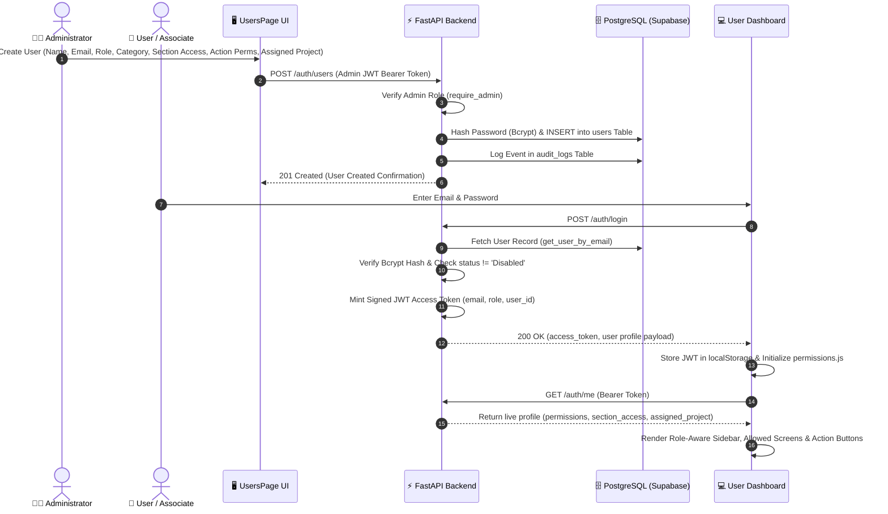
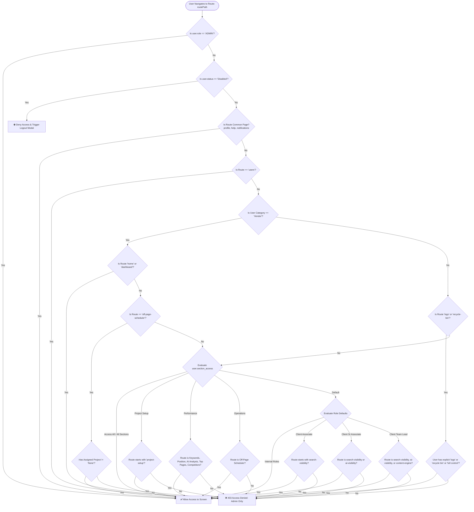
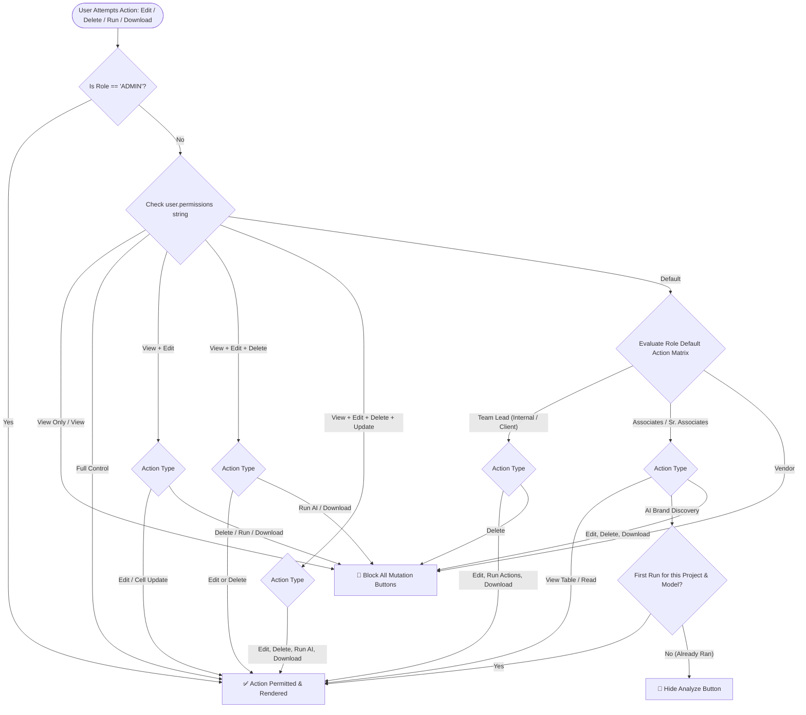
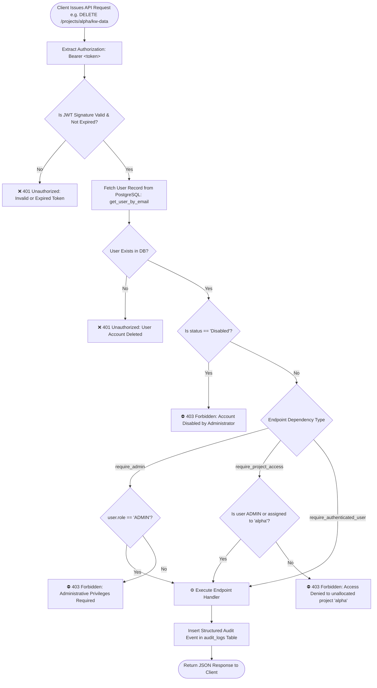

# 🛡️ Dedicated Role-Based Access Control (RBAC) Specification & Architecture Guide

[](https://fastapi.tiangolo.com)
[](https://react.dev)
[](#1-core-security-architecture--principles)
[](#6-multi-tenant-data-isolation-assigned_project)

This document provides the definitive, end-to-end technical reference for the **Role-Based Access Control (RBAC)** and authorization system across both the **FastAPI Backend Gateway** and the **React Dashboard Frontend**.

---

## 📑 Table of Contents

- [1. Core Security Architecture & Principles](#1-core-security-architecture--principles)
- [2. The 4-Tier Permission Architecture](#2-the-4-tier-permission-architecture)
- [3. Categories & Roles Specification](#3-categories--roles-specification)
- [4. Visual Flow Diagrams](#4-visual-flow-diagrams)
  - [4.1 End-to-End User Provisioning & Authentication Flow](#41-end-to-end-user-provisioning--authentication-flow)
  - [4.2 Screen & Navigation Route Access Decision Tree](#42-screen--navigation-route-access-decision-tree)
  - [4.3 Action & Mutation Permission Decision Tree](#43-action--mutation-permission-decision-tree)
  - [4.4 Backend Request Validation & IDOR Prevention Flow](#44-backend-request-validation--idor-prevention-flow)
- [5. Screen / Page Access Matrix (Who Can See What Screen)](#5-screen--page-access-matrix-who-can-see-what-screen)
- [6. Action & Operation Matrix (Who Can Perform What Action)](#6-action--operation-matrix-who-can-perform-what-action)
- [7. Multi-Tenant Data Isolation (`assigned_project`)](#7-multi-tenant-data-isolation-assigned_project)
- [8. Associate & Vendor Guardrails](#8-associate--vendor-guardrails)
- [9. Backend Enforcement & Dependency Injection](#9-backend-enforcement--dependency-injection)
- [10. Admin Configuration & User Management Workflow](#10-admin-configuration--user-management-workflow)

---

## 1. Core Security Architecture & Principles

The security model is built on four non-negotiable architectural rules:

1. **Zero Client Trust**: Authorization decisions are never made based on unverified client-side state (`localStorage`, `sessionStorage`, request body claims like `role: "ADMIN"`). Every mutating request is validated server-side against cryptographically verified JWT access tokens.
2. **Deny By Default**: If a route, screen, API endpoint, or UI button is not explicitly granted to a user profile by role or admin override, access is blocked immediately (`403 Forbidden` / button hidden).
3. **Multi-Tenant Isolation**: Non-admin users are locked to their `assigned_project`. Direct Object Reference (IDOR) attacks attempting to access cross-tenant project data are rejected server-side.
4. **Immediate Revocation**: If an administrator sets a user's status to `"Disabled"`, all active sessions for that user are rejected instantly on their next request, regardless of whether their JWT token has expired.

---

## 2. The 4-Tier Permission Architecture

Every user profile in the database is defined by four orthogonal permission dimensions:

```
┌────────────────────────────────────────────────────────────────────────┐
│                          USER IDENTITY RECORD                          │
├───────────────────┬───────────────────┬────────────────────────────────┤
│ 1. CATEGORY       │ 2. ROLE           │ 3. SECTION ACCESS (Screens)    │
│ • Admin           │ • ADMIN           │ • Default (Role-based)         │
│ • Internal        │ • TEAM_LEAD       │ • Access All / All Sections    │
│ • Client Access   │ • SR_ASSOCIATE    │ • Project Setup                │
│ • Vendor          │ • ASSOCIATE       │ • Performance                  │
│                   │ • VENDOR          │ • Operations                   │
├───────────────────┴───────────────────┴────────────────────────────────┤
│ 4. ACTION PERMISSIONS (Mutations & Operations)                         │
│ • Default (Role-based)                • View + Edit + Delete + Update  │
│ • View Only (Read-Only)               • Full Control                   │
│ • View + Edit                         • Special: Logs / Recycle Bin    │
│ • View + Edit + Delete                                                 │
├────────────────────────────────────────────────────────────────────────┤
│ 5. MULTI-TENANT SCOPE: assigned_project ("All Projects" or "slug_name")│
└────────────────────────────────────────────────────────────────────────┘
```

---

## 3. Categories & Roles Specification

Users belong to one of **4 Primary Categories**, which encompass **8 Distinct Roles**:

| User Category | Internal Role Key | Display Name | Target Persona | Default Access Scope |
| :--- | :--- | :--- | :--- | :--- |
| **`Admin`** | `ADMIN` | **Admin** | System administrators, agency directors | Full system access, all projects, user management, audit logs, recycle bin |
| **`Internal`** | `INTERNAL_TEAM_LEAD` | **Team Lead** | Internal SEO Team Lead / Project Manager | All workspace modules, continuous AI analysis, editing, clustering, rank checking |
| **`Internal`** | `INTERNAL_SR_ASSOCIATE` | **Sr. Associate** | Senior SEO Specialists | All workspace modules, single-run AI analysis, view-only default action scope |
| **`Internal`** | `INTERNAL_ASSOCIATE` | **Associate** | SEO Executives & Content Writers | All workspace modules, single-run AI analysis, view-only default action scope |
| **`Client Access`** | `CLIENT_TEAM_LEAD` | **Client Team Lead** | External client account managers | Performance & AI Visibility modules, continuous AI analysis, view + edit |
| **`Client Access`** | `CLIENT_SR_ASSOCIATE` | **Client Sr. Associate**| Client marketing analysts | Performance & AI Visibility modules, single-run AI analysis, view-only |
| **`Client Access`** | `CLIENT_ASSOCIATE` | **Client Associate** | Client junior reviewers | Performance module only, single-run AI analysis, view-only |
| **`Vendor`** | `VENDOR` | **Vendor** | External publishers & guest post vendors | Strictly locked to Off-Page Operations / Scheduler, view-only default |

---

## 4. Visual Flow Diagrams

### 4.1 End-to-End User Provisioning & Authentication Flow



---

### 4.2 Screen & Navigation Route Access Decision Tree

This decision tree shows how `canAccessRoute(user, routePath)` evaluates whether a user can open a screen:



---

### 4.3 Action & Mutation Permission Decision Tree

This decision tree illustrates how granular UI buttons (Edit, Delete, AI Run, Download) are evaluated:



---

### 4.4 Backend Request Validation & IDOR Prevention Flow



---

## 5. Screen / Page Access Matrix (Who Can See What Screen)

This matrix defines exact screen accessibility across all dashboard pages:

| Dashboard Screen / Route | Route Identifier | `ADMIN` | `INTERNAL_TEAM_LEAD` | `INTERNAL_ASSOCIATE` | `CLIENT_TEAM_LEAD` | `CLIENT_ASSOCIATE` | `VENDOR` | Override Section Access Required (if not Default) |
| :--- | :--- | :---: | :---: | :---: | :---: | :---: | :---: | :--- |
| **Home Page** | `home` | ✅ | ✅ | ✅ | ✅ | ✅ | ❌ | Allowed by default (except Vendor) |
| **Project Dashboard** | `dashboard` | ✅ | ✅ | ✅ | ✅ | ✅ | ❌ | Allowed by default (except Vendor) |
| **Project Setup** | `project-setup` | ✅ | ✅ | ✅ | ❌ | ❌ | ❌ | `Project Setup` or `Access All` |
| **Keywords (KW Cluster)** | `search-visibility/keywords` | ✅ | ✅ | ✅ | ✅ | ✅ | ❌ | `Performance` or `Access All` |
| **Position Analysis** | `search-visibility/position-analysis`| ✅ | ✅ | ✅ | ✅ | ✅ | ❌ | `Performance` or `Access All` |
| **AI Analysis (Diagnostics)**| `search-visibility/ai-analysis` | ✅ | ✅ | ✅ | ✅ | ✅ | ❌ | `Performance` or `Access All` |
| **Top Pages (Landing/Blog)** | `search-visibility/top-pages` | ✅ | ✅ | ✅ | ✅ | ✅ | ❌ | `Performance` or `Access All` |
| **Competitors Intelligence**| `search-visibility/competitors` | ✅ | ✅ | ✅ | ✅ | ✅ | ❌ | `Performance` or `Access All` |
| **Off-Page Scheduler** | `search-visibility/off-page-scheduler`| ✅ | ✅ | ✅ | ❌ | ❌ | ✅* | `Operations` or `Access All` (*requires assigned project) |
| **AI Visibility (AIO/LLMO)** | `ai-visibility` | ✅ | ✅ | ✅ | ✅ | ❌ | ❌ | `Access All` |
| **Content Engine** | `content-engine` | ✅ | ✅ | ✅ | ✅ | ❌ | ❌ | `Access All` |
| **Calendar Scheduler** | `calendar` | ✅ | ✅ | ✅ | ❌ | ❌ | ❌ | `Operations` or `Access All` |
| **Agency Management** | `agency` | ✅ | ✅ | ✅ | ❌ | ❌ | ❌ | `Operations` or `Access All` |
| **User Management** | `users` | ✅ | ❌ | ❌ | ❌ | ❌ | ❌ | **ADMIN Role Only** (Hardcoded) |
| **System Audit Logs** | `logs` | ✅ | ❌ | ❌ | ❌ | ❌ | ❌ | `ADMIN` or Action Permission containing `logs` |
| **Recycle Bin (Recovery)** | `recycle-bin` | ✅ | ❌ | ❌ | ❌ | ❌ | ❌ | `ADMIN` or Action Permission containing `recycle bin` |
| **My Profile & Attendance** | `profile` | ✅ | ✅ | ✅ | ✅ | ✅ | ✅ | Available to all authenticated users |

---

## 6. Action & Operation Matrix (Who Can Perform What Action)

This matrix defines granular operation rights inside tables, modals, and toolbars:

| Feature / Action | `ADMIN` | `INTERNAL_TEAM_LEAD` | `INTERNAL_ASSOCIATE` (Default) | `VENDOR` (Default) | Action Permission String Required for Non-Default Grant |
| :--- | :---: | :---: | :---: | :---: | :--- |
| **View Tables & Charts** | ✅ | ✅ | ✅ | ✅ | `View Only`, `View + Edit`, `Full Control` |
| **Inline Cell Edit** (Keyword/Page metadata) | ✅ | ✅ | ❌ | ❌ | `View + Edit`, `View + Edit + Delete`, `Full Control` |
| **Upload Keywords / Pages** (Sheet import) | ✅ | ✅ | ❌ | ❌ | `View + Edit`, `Full Control` |
| **Delete Single Keyword / Page / Competitor**| ✅ | ❌ | ❌ | ❌ | `View + Edit + Delete`, `Full Control` |
| **Bulk Delete Keywords / Pages** | ✅ | ❌ | ❌ | ❌ | `View + Edit + Delete`, `Full Control` |
| **Trigger AI-Clustering** (`/categorize`) | ✅ | ✅ | ❌ | ❌ | `View + Edit + Delete + Update`, `Full Control` |
| **Trigger SERP Rank Check** (`/check-rank`) | ✅ | ✅ | ❌ | ❌ | `View + Edit + Delete + Update`, `Full Control` |
| **Run Brand Discovery / AI Analysis** | ✅ | ✅ (Unlimited)| ⚠️ (1 Run per model)* | ❌ | `Full Control` (Unlimited) / Role Default (1 Run) |
| **Download CSV / Excel Exports** | ✅ | ✅ | ❌ | ❌ | `View + Edit + Delete + Update`, `Full Control`, `download` |
| **Run Monthly Resource Allocation** | ✅ | ✅ | ❌ | ❌ | `Full Control`, `ADMIN` |
| **Run Headless Live Link Audit** (Playwright)| ✅ | ✅ | ❌ | ❌ | `Full Control`, `ADMIN` |
| **Create User Credentials** | ✅ | ❌ | ❌ | ❌ | **ADMIN Role Only** |
| **Toggle User Status** (`Active`/`Disabled`)| ✅ | ❌ | ❌ | ❌ | **ADMIN Role Only** |
| **Update User Role & Permissions** | ✅ | ❌ | ❌ | ❌ | **ADMIN Role Only** |
| **Restore from Recycle Bin** | ✅ | ❌ | ❌ | ❌ | `ADMIN` or Action Permission containing `recycle bin` |
| **Purge Audit Logs** | ✅ | ❌ | ❌ | ❌ | **ADMIN Role Only** |
| **Daily Attendance Check-in** | ✅ | ✅ | ✅ | ✅ | Available to all active user profiles |

*\* Note on Associate AI Single-Run Limitation: To prevent unnecessary LLM token consumption, Associates are granted 1 execution of AI Brand Discovery / AI Analysis per model per project. Once results exist in the database, the Analyze button automatically hides for that Associate.*

---

## 7. Multi-Tenant Data Isolation (`assigned_project`)

Every non-admin user account has an `assigned_project` field configured in PostgreSQL:

### Scoping Rules:
1. **Unrestricted (`All Projects`)**: When `assigned_project` is set to `"All Projects"`, `"*"` or left blank, the user can select and switch between all registered client projects.
2. **Single Tenant (e.g., `"real_estate_clients"`)**: The user's sidebar project dropdown is locked strictly to `real_estate_clients`.
3. **Multi-Tenant List (e.g., `"owis, stamford_american"`)**: The user can access only the designated comma-separated project slugs.

### Backend Defense-in-Depth (`require_project_access`):
Even if a malicious actor manually tampers with client-side React code to issue an HTTP request for another project:

```python
# From backend/auth/dependencies.py
def require_project_access(request: Request, current_user: dict = Depends(require_authenticated_user)) -> dict:
    project = request.path_params.get("project") or request.path_params.get("project_slug")
    role = str(current_user.get("role", "")).upper()
    category = str(current_user.get("category", "")).upper()
    
    if role == "ADMIN" or (role != "VENDOR" and category != "VENDOR"):
        return current_user  # Internal team lead/admin
        
    assigned_project = str(current_user.get("assigned_project", "")).strip().lower()
    assigned_list = [p.strip().lower() for p in assigned_project.split(",") if p.strip()]
    
    req_slug = str(project).strip().lower()
    if req_slug not in assigned_list and assigned_project != req_slug:
        raise HTTPException(
            status_code=status.HTTP_403_FORBIDDEN,
            detail=f"Access denied: your account is not allocated to project '{project}'."
        )
    return current_user
```

---

## 8. Associate & Vendor Guardrails

### 1. Vendor Sandboxing:
- **Navigation Lockdown**: The `Home` and `Dashboard` pages are strictly hidden for Vendors.
- **Workflow Focus**: Vendors are routed directly to `Off-Page Operations / Scheduler`.
- **Project Gate**: If a Vendor has `assigned_project: "None"` or unassigned, they cannot view off-page links until an Admin allocates a project.
- **Read-Only Default**: Vendors cannot delete rows or tamper with project schemas; they can only update status on their assigned guest post lines.

### 2. Associate Cost Control (AI Run Limits):
To protect API quotas across OpenAI and Gemini:
- **Unlimited**: Admins and Team Leads can re-run AI models at will.
- **Controlled**: When an Associate hits *Analyze*, the frontend executes `recordAiModelAnalysisRun(user, projectSlug, engineName)` storing a persistent lock key in `localStorage`. Once data is returned, the button transitions to a view-only state.

---

## 9. Backend Enforcement & Dependency Injection

The backend uses FastAPI's dependency injection system to enforce authorization before any endpoint logic is reached:

```python
from fastapi import FastAPI, Depends
from auth.dependencies import require_authenticated_user, require_admin, require_project_access

# 1. Any Active User
@app.get("/projects")
def list_projects(user: dict = Depends(require_authenticated_user)):
    ...

# 2. Project-Scoped User (prevents IDOR)
@app.post("/projects/{project}/categorize")
def categorize_keywords(project: str, user: dict = Depends(require_project_access)):
    ...

# 3. System Administrator Only
@app.delete("/projects/{project}/hard")
def hard_delete_project(project: str, admin: dict = Depends(require_admin)):
    ...
```

---

## 10. Admin Configuration & User Management Workflow

System Administrators configure and audit RBAC directly from the **Users Management Page (`/users`)**:

### Step 1: Open User Management
Log in with an `ADMIN` account and click **Users** in the sidebar navigation.

### Step 2: Create or Edit User Credentials
Click **Add New User** and configure:
1. **Full Name & Login Email**: Unique email identifier.
2. **Password**: Salted with Bcrypt on submission.
3. **Category**: Select `Admin`, `Internal`, `Client Access`, or `Vendor`.
4. **Role**: Select specific seniority level (e.g., `Team Lead`, `Sr. Associate`, `Associate`).
5. **Section Access**: Choose `Default`, `Access All`, `Project Setup`, `Performance`, or `Operations`.
6. **Action Permissions**: Choose `Default`, `View Only`, `View + Edit`, `View + Edit + Delete`, `View + Edit + Delete + Update`, or `Full Control`.
7. **Assigned Project**: Choose `All Projects` or allocate specific client slugs.
8. **Client Detail Settings** *(Optional)*: Attach Client Name, Address, GST, and POC Contact Information.

### Step 3: Real-Time Account Updates & Revocation
- **Status Toggle**: Toggle a user's switch from **Active** to **Disabled**. The user is immediately logged out, and any subsequent API request is rejected with `403 Forbidden`.
- **Live Permission Updates**: When an Admin updates a user's role or section access, the user's active session triggers the `AccountUpdateModal` alerting them of their updated permission scope without requiring manual re-registration.

---

## 📄 Summary Checklist for Developers

When building new features, always apply these RBAC checks:

- [ ] **Backend Router**: Apply `Depends(require_authenticated_user)`, `Depends(require_project_access)`, or `Depends(require_admin)` to all new endpoints in `backend/app.py`.
- [ ] **Audit Logging**: Add `db.insert_audit_log(user_email, action, status, project_name)` to all mutating endpoints.
- [ ] **Frontend Route Guard**: Wrap new routes in `canAccessRoute(user, routePath)` inside `src/App.jsx` and `src/components/layout/Sidebar.jsx`.
- [ ] **Frontend Action Guard**: Wrap Edit/Delete/Run buttons in `canEdit(user)`, `canDelete(user)`, `canUpdate(user)`, or `canRunActions(user)`.
